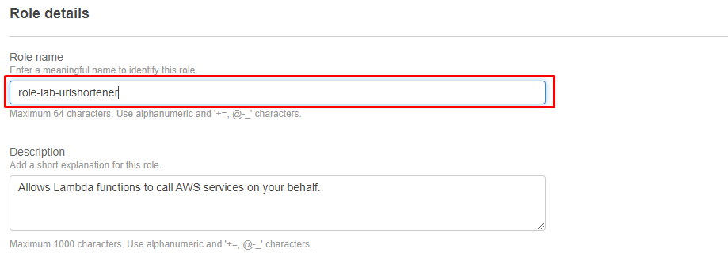
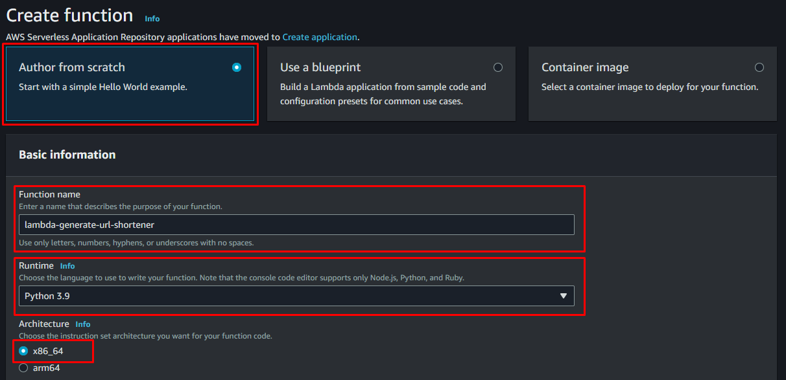

# CloudFaster Academy: Laboratório Serverless URL Shortener

> **Autor:** [CloudFaster Tecnologia](https://cloudfaster.com.br), **Última revisão:** 28/10/2022

## Introdução

Serviços *serveless*, além de nos proporcionar a criação de aplicações altamente disponíveis, nos permitem criar e implantar de forma rápida nossas aplicações, isso porque não precisamos nos preocupar com a infraestrutura que será necessária para que nossa aplicação seja executada, precisamos nos preocupar apenas com a lógica da aplicação, os recursos necessários serão provisionados pela AWS com apenas alguma configurações que podemos fazer diretamente na console da AWS, ou via AWS CLI.\
\
Neste laboratório iremos construir uma aplicação que será responsável por encurtar URLs para que possamos compartilhar com nossos amigos, clientes, familiares, etc. Nosso primeiro passo é pensar na arquitetura da nossa aplicação, saber quais serviços a AWS nos fornece que poderá nos auxiliar no desenvolvimento da aplicação. Abaixo temos um diagrama de como foi arquitetado nosso encurtador de URL e quais serviços utilizaremos.\
\

\
\
Para criar uma nova URL encurtada, o primeiro passo é informar para aplicação qual URL original e por quanto tempo a URL encurtada estará disponível. Assim, iremos realizar uma requisição via API através do *Amazon API Gateway*, essa API tem um endpoint que será traduzido pelo nosso serviço de DNS o *Amazon Route 53*. No corpo da requisição serão informados os dados necessários para encurtar a URL, como endereço original, tempo de vida da URL gerada e, opcionalmente, um nome personalizado para que seja o código da URL encurtada, isso fará com que em vez de ser gerado um código aleatório para passar como *path parameter*, seja utilizado um nome definido (Ex: <https://lab-academy.cf/aws>). A *API Gateway* irá acionar uma função do *AWS Lambda* que executará o código da aplicação e armazenará o resultado em uma tabela do *Amazon DynamoDB* e retornará o resultado para o requisitante.\
\
Agora com a URL na mão, atravéz de um Browser qualquer, poderemos digita-lo na barra de endereços, esse endereço será traduzido pelo *Amazon Route 53* e encaminhará a requisição para o *Amazon CloudFront*, que assim que recebe a requisição, dispara uma função do *AWS Lambda* que irá procurar o código informado na tabela do *Amazon DynamoDB* e retornará o endereço para onde o *Amazon CloudFront* irá realizar o redirecionamento. Esse endereço poderá ser uma URL externa ou até uma URL pré-assinada de um objeto em um Bucket do *Amazon S3*.\
\
Para adicionarmos uma camada de segurança para nossa aplicação, utilizaremos o *AWS WAF* para ser noss Web Application Firewall, e também adicionaremos um serviço de SSL para criptografia de dados em trânsito com o *AWS Certificate Manager*, esses serviços são interligados diretamente nos nossos serviços do *Amazon CloudFront* e *Amazon API Gateway*. Para que nossa função do *AWS Lambda* possa acessar outros serviços da AWS, adicionamos uma função do *AWS IAM Role*. E, finalmente, para analisar tudo que acontece na nossa aplicação, temos o *Amazon CloudWatch Logs* que armazenará todos os LOGS gerados pela aplicação.

## Hands-on

Neste laboratório você aprenderá como criar uma *role* (função) do *AWS IAM Role*, configurar criar uma função do *AWS Lambda*, criar uma API no *Amazon API Gateway* e vincular uma função Lambda, configurar um certificado SSL com o *AWS Certificate Manager*, criar um endpoint customizado da API Gateway, criar uma tabela no *Amazon DynamoDB*, criar uma distribuição do *Amazon CloudFront*, vincular o *AWS WAF* ao CloudFront e API Gateway e por fim, como manipular registros DNS no *Amazon Route 53*.

### Pré-requisitos

1) Uma conta na AWS.
2) Um usuário com permissões suficientes para acessar os recursos necessários (IAM, Route 53, Lambda, DynamoDB e API Gateway, ACM e CloudFront).
3) Um DNS já pré-configurado no *Amazon Route 53*.

> **Importante:** O domínio deve ser registrado com antecedencia no *Amazon Route 53*, já que a propagação dos *Names Servers* podem levar até 24h.

### Passo 1: Criar uma Role do IAM

Após acessar sua conta AWS, navegue até o serviço *AWS IAM Roles* ou acesse diretamente por esse link: <https://console.aws.amazon.com/iamv2/#/roles>.\
Clique no botão `Create role`.\
\

\
\
Na próxima tela, selecione o tipo de entidade confiável `AWS service`, selecione o caso de usos `Lambda` e clique em `Next`.\
\

\
\
Na tela seguinte, adicione as permissões (*policies*) necessárias para que nossas funções Lambda tenham acesso aos serviços necessários. Adicione as seguintes *policies*:

* AWSLambdaBasicExecutionRole
* AmazonDynamoDBFullAccess
* AmazonS3FullAccess

> **Atenção:** Não é aconselhavel utilizar uma IAM Policy de Full Access. Seguindo as boas práticas de segurança, é sempre recomendável utilizar permissões granulares com o menor privilégio. Utilizaremos essa IAM Policy apenas para fins didáticos.

Ao finalizar, clique em `Next`.\
\

\
\
Dê um nome para sua *IAM Role*, para fins de exemplo utilizarei "role-lab-urlshortener", revise os dados e em seguida clique em `Create role`.\
\

\
\
Pronto sua IAM Role, está criada e pronta para ser anexada à sua função Lambda, podemos seguir para o passo 2.

### Passo 2: Criar a tabela no DynamoDB

Após acessar sua conta AWS, navegue até o serviço *Amazon DynamoDB* ou acesse diretamente por esse link: <https://console.aws.amazon.com/dynamodbv2/#tables>.\
\
No dashboard do serviço, procure e clique no botão `Create table`.\
\
Na tela de criação da tabela, dê um nome para nossa tabela, para fins de exemplo utilizarei "lab-urlshortener", e informe uma partition key, para nosso exemplo utilizarei `id`.\
\
Mantenha o restante das configurações conforme sugerido, e clique em `Create table`.\

> **Atenção:** Verifique qual a região da AWS você criou a tabela, pois precisaremos dessa informação para que nosso Lambda possa acessar o serviço.

\
\
O processo da criação demora alguns segundos, podemos seguir para o passo 3.

### Passo 3: Criar a função Lambda que irá gerar a URL encurtada

Após acessar sua conta AWS, navegue até o serviço *AWS Lambda* ou acesse diretamente por esse link: <https://console.aws.amazon.com/lambda>.\
\
Na tela do serviço será listado todas as funções lambdas disponíveis para a região selecionada e teremos um botão `Create Function` no canto superiror direito da listagem, clique nele.\
\
Na tela seguinte, mantenha a opção `Author from scratch` selecionada, informe um nome para sua função, para nosso exemplo utilizarei "lambda-generate-url-shortener", em seguida escolha um *Runtime* e a arquitetura que você quer que seu código seja executado, para esse exemplo utilizaremos Python 3.9 em uma arquitetura x86_64.\
\

\
\
Desça a tela um pouco e abra as opões presentes em `Change default execution role`, marque a opção `Use an existing role` e no campo `Existing role` selecione a *IAM Role* criada no passo 1, em seguida, clique em `Create Function`.\
\

\
\
Sua função Lambda será criada e será possível editar o código diretamente no *Browser*.\
\
Apague o conteúdo do arquivo "lambda_function.py" aberto no editor de código da função Lambda, copie todo o conteúdo do arquivo [`lambdas/lambda-generate-url-shortener.py`](https://github.com/cloudfaster-academy-workshop/demo-lambda-dynamodb/blob/main/lambdas/lambda-generate-url-shortener.py), disponível neste repositório, e cole no editor de código da função Lambda.\
